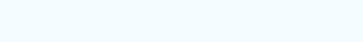
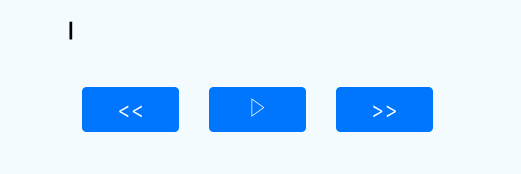

react-native-newsticker
==
> The News Ticker component for React Native

[]()[]()

[](https://nodei.co/npm/react-native-newsticker/)

Demo
---





Installation
==

in Cli
---
```
npm i react-native-newsticker
```

in JavaScirpt
---
```
import Newsticker from 'react-native-newsticker';
```


Usage
===

Default
---
```
<Newsticker text={'This is a really awesome Newsticker !!'} />
```

Customized
---
```
<Newsticker
  style={styles.alignLeft}
  typeInterval={100}
  blinkInterval={500}
  onFinish={() => {this.onFinish()}}
  cursor={true}
  start={this.state.is_begin}
  back={this.state.is_back}
  text={'This is a really awesome Newsticker !!'}
/>
```


Props
===

text(String) `Default: ''`
---
The text of newsticker

start(boolean) `Default: true`
---
If you pass false, newsticker does’nt start. If you pass the false while runnning, newsticker is stopped. You can toggle newsticker using this param.

back(boolean) `Default: false`
---
If you pass true when `start` is true, newsticker start to backward.

typeInterval(int) `Default: 100`
---
newstick interval

blinkInterval(int) `Default: 500`
---
blink interval of cursor

onFinish(function)
---
if finish newstick, this function is called

cursor(boolean) `Default: true`
---
In default, The cursor apeer in right of text. when newsticker is end, cursor starts blink.
if you pass false, cursor is not shown.

style `Default: ''`
---
Style of text


Contributing
==
Of course! Welcome :)


License
==
MIT

